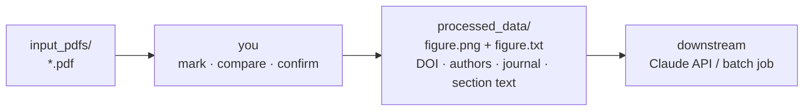
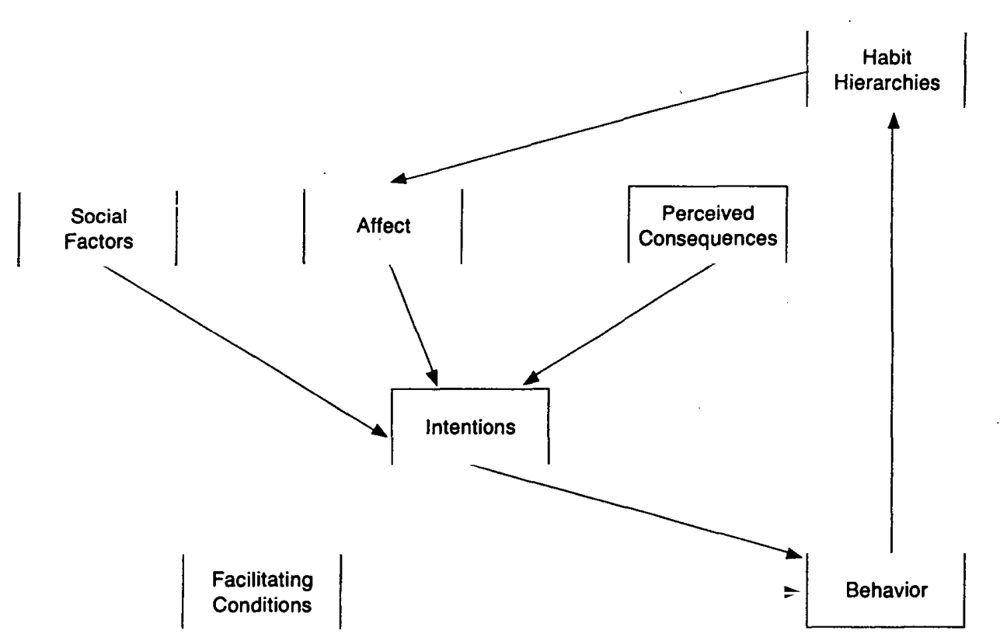
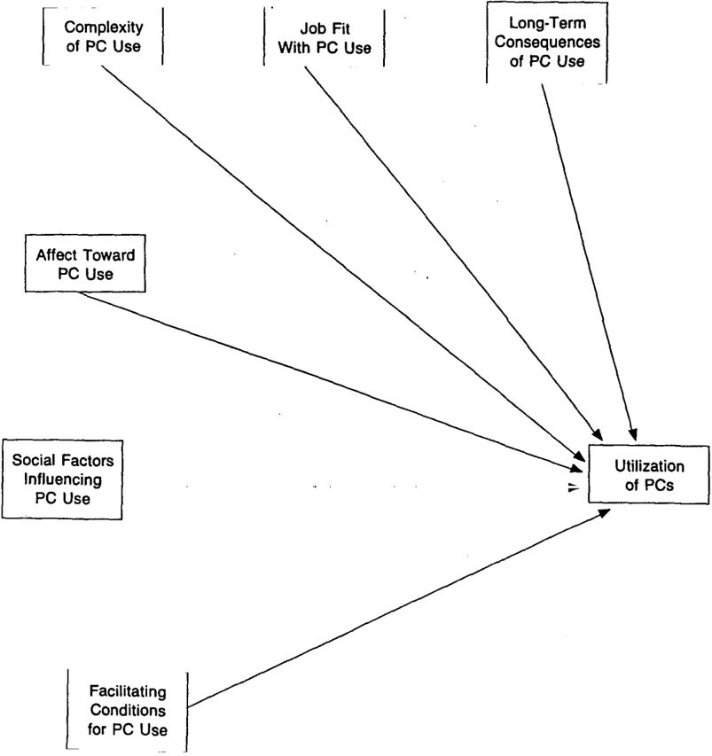

# SEM Diagram Triage

Extracts Structural Equation Model diagrams from academic PDFs, with a human deciding which figures
matter.

**In:** a folder of PDFs.
**You:** click the figures worth keeping.
**Out:** per figure, a cropped PNG and a matching TXT holding the paper's DOI, authors, journal and
the section of text the figure sits in — sized to be fed to a Claude API or batch job later.



`docling` only runs on pages you actually click, in a background thread, so the UI does not block.

---

## Setup

```bash
python3 -m venv .venv
source .venv/bin/activate
pip install -r requirements.txt
streamlit run sem_triage_app.py
```

Put PDFs in `input_pdfs/` and reload. Optionally add a local `.env` (gitignored) to use Crossref's
polite pool, which is faster and less rate-limited:

```
CROSSREF_MAILTO=your@email.address
```

---

## Workflow

One PDF at a time. Confirming loads the next paper immediately; saving, the DOI lookup and text
extraction finish in the background.


| Key | Action |
| --- | --- |
| **←** / **→** | Previous / next page |
| **Enter** | Advance (marking → compare → save) |
| **R** | Recrop the selected figure |
| **D** | Disregard the PDF → `disregard/` |
| **Esc** | Cancel a recrop |

**Marking.** Clicking a figure drops a numbered marker and starts a `docling` pass on that page
alone. Keep clicking and paging; a marker shows `…` until its crop is ready.

**Comparing.** Candidates appear side by side at a uniform size, captioned with the figure caption
`docling` found. Click to select; select as many as you want, each saved separately. A single
candidate is selected automatically.

**Recropping.** Automatic detection misses on some layouts, e.g. multi-panel figures. Press **R** and
drag a box. The crop is cut from a fresh high-resolution render, so it is identical whether you drew
it at 75% or 200% zoom. A candidate whose crop failed is labelled *extraction failed — press R to
redraw* and cannot be confirmed until redrawn.

---

## Output

```
processed_data/
├── paper_m1.png     cropped figure
├── paper_m1.txt     metadata + context
├── paper_m3.png     second figure from the same paper
├── paper_m3.txt
└── log.jsonl        one line per saved figure
```

```text
Title: Trust in Automation: Integrating Empirical Evidence on Factors That Influence Trust
Authors: Kevin Anthony Hoff; Masooda Bashir
Journal: Human Factors: The Journal of the Human Factors and Ergonomics Society
DOI: 10.1177/0018720814547570
DOI source: printed-in-pdf (Crossref-confirmed)

--- First page text ---
(all of page 1 — title, authors, abstract …)

--- Section containing the figure (page 7) ---
(the section the figure sits in, from its heading to the next one,
 across however many pages that spans)
```

The PDF then moves to `completed/`, or `disregard/` if skipped.

| Directory | Contents |
| --- | --- |
| `input_pdfs/` | Queue — drop PDFs here |
| `processed_data/` | Output PNG + TXT pairs, and `log.jsonl` |
| `completed/` | PDFs you kept a figure from |
| `disregard/` | PDFs you skipped |

---

## How the DOI is found

A title search can return a different paper, so sources are tried in order of trustworthiness and the
one used is recorded in the `DOI source:` line:

1. **DOI printed in the paper**, confirmed against Crossref.
2. **DOI printed in the paper, unconfirmed** — if Crossref is unreachable or does not know it.
3. **Crossref title search** — accepted only above 0.75 title similarity.
4. **OpenAlex title search** — same similarity gate; covers papers Crossref's title index misses.
5. Otherwise `unknown`. Some papers have no DOI.

Lookups are cached per paper: five figures from one PDF cause one request.

---

## Notes

- Markers live in memory. Refreshing mid-paper restarts that PDF; confirmed papers are already on disk.
- Shortcuts do not fire while you are typing in a field.
- OCR is off: it took a page from ~2.5 s to ~21 s, and published PDFs carry a text layer. Scanned
  PDFs will not yield text.
- `.env` is gitignored.

---

## Worked example

Two real papers, using the tool's actual output.

### One figure, DOI resolved by the OpenAlex fallback

`MISQ_1990_14_3_1.pdf` — one figure marked on page 4.


<sub>Extracted from Bergeron, Rivard & de Serre (1990), *MIS Quarterly*,
<a href="https://doi.org/10.2307/248887">10.2307/248887</a>.</sub>

```text
Title: Investigating the Support Role of the Information Center
Authors: François Bergeron; Suzanne Rivard; Lyne de Serre
Journal: MIS Quarterly
DOI: 10.2307/248887
DOI source: openalex title match

--- Section containing the figure (page 4) ---
Location

According to several authors, an appropriate location for the IC is critical. Providing users
with distributed support services was the first recommendation made by Rockart and Flannery
(1983) about support. …
```

Crossref's title search did not match this 1990 paper confidently, so step 4 resolved it. Without
that fallback the line would read `unknown`. The captured section starts at its real heading,
**Location**, not at an arbitrary page boundary.

### Two figures from one paper

`MISQ_1991_15_1_7.pdf` — figures on pages 3 and 7, both selected.

| `…_m1.png` — page 3 | `…_m2.png` — page 7 |
| --- | --- |
|  |  |

<sub>Extracted from Thompson, Higgins & Howell (1991), *MIS Quarterly*,
<a href="https://doi.org/10.2307/249443">10.2307/249443</a>.</sub>

Both files share paper-level metadata from a single Crossref lookup, but each carries its own
figure's section:

```text
Title: Personal Computing: Toward a Conceptual Model of Utilization1
Authors: Ronald L. Thompson; Christopher A. Higgins; Jane M. Howell
Journal: MIS Quarterly
DOI: 10.2307/249443
DOI source: crossref title match
```

The trailing `1` is a footnote marker in the paper's own title; the tool records what it read.

### Resulting files

```text
processed_data/
├── MISQ_1990_14_3_1_m1.png   MISQ_1990_14_3_1_m1.txt
├── MISQ_1991_15_1_7_m1.png   MISQ_1991_15_1_7_m1.txt
├── MISQ_1991_15_1_7_m2.png   MISQ_1991_15_1_7_m2.txt
└── log.jsonl

completed/
├── MISQ_1990_14_3_1.pdf
└── MISQ_1991_15_1_7.pdf
```

```json
{"pdf": "MISQ_1990_14_3_1.pdf", "action": "completed", "image": "MISQ_1990_14_3_1_m1.png", "page": 4, "chosen_marker_number": 1, "doi": "10.2307/248887", "doi_source": "openalex title match", "journal": "MIS Quarterly"}
{"pdf": "MISQ_1991_15_1_7.pdf", "action": "completed", "image": "MISQ_1991_15_1_7_m1.png", "page": 3, "chosen_marker_number": 1, "doi": "10.2307/249443", "doi_source": "crossref title match", "journal": "MIS Quarterly"}
{"pdf": "MISQ_1991_15_1_7.pdf", "action": "completed", "image": "MISQ_1991_15_1_7_m2.png", "page": 7, "chosen_marker_number": 2, "doi": "10.2307/249443", "doi_source": "crossref title match", "journal": "MIS Quarterly"}
```
