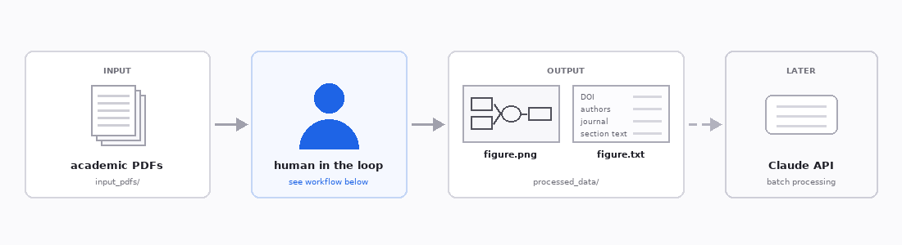
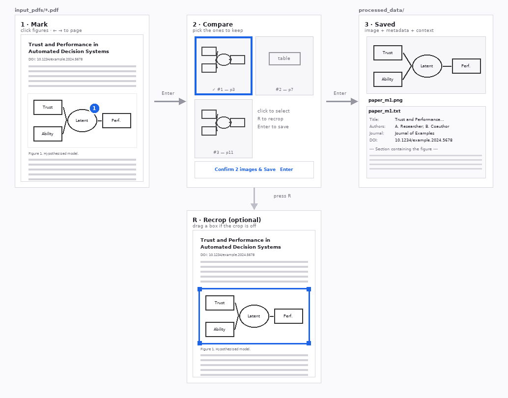
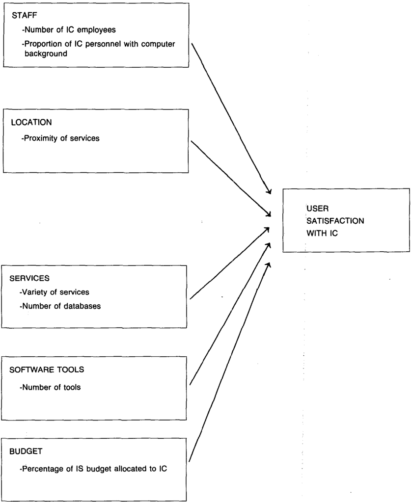

Extracts Structural Equation Model diagrams from academic PDFs, with a person deciding which figures
matter.



### Demo

<a href="https://youtu.be/EYGeeshKDPs">
  
</a>

▶ [Watch SEMify in use](https://youtu.be/EYGeeshKDPs)

---

## Workflow

One PDF at a time. Confirming loads the next paper immediately; saving, the DOI lookup and text
extraction finish in the background.



1. **Mark** — the PDF opens page by page in the browser. Click each figure worth keeping; a numbered
   marker appears and that page is analysed in the background.
2. **Compare** — the marked figures are shown side by side with their captions. Click the ones to
   keep; any number can be selected.
3. **Saved** — each selected figure is written as a PNG plus a TXT with the paper's metadata and
   surrounding section, and the next PDF loads straight away.

**R · Recrop** (optional) — if a crop came out wrong, drag a box around the figure by hand instead.

| Key | Action |
| --- | --- |
| **←** / **→** | Previous / next page |
| **Enter** | Advance (marking → compare → save) |
| **R** | Recrop — drag a box when the automatic crop is wrong |
| **D** | Disregard the PDF → `disregard/` |
| **F** | Full view — hide the sidebar and controls for the largest possible page |
| **Esc** | Cancel a recrop |

The page scales to fill the window, so the whole page is visible without scrolling on any screen.
Turn off **Fit page to window** in the sidebar to view it at a fixed zoom and scroll instead; while
fitted, the zoom setting controls sharpness rather than size.

---

## Output

```
processed_data/
├── paper_m1.png     cropped figure
├── paper_m1.txt     DOI, authors, journal, page-1 text, section text
├── paper_m3.png     second figure from the same paper
├── paper_m3.txt
└── log.jsonl        one line per saved figure
```

The PDF then moves to `completed/`, or `disregard/` if skipped.

| Directory | Contents |
| --- | --- |
| `input_pdfs/` | Queue — drop PDFs here |
| `processed_data/` | Output PNG + TXT pairs, and `log.jsonl` |
| `completed/` | PDFs a figure was kept from |
| `disregard/` | Skipped PDFs |

---

## How the DOI is found

A title search can return a different paper, so sources are tried in order of trustworthiness and the
one used is recorded in the `DOI source:` line:

1. **DOI printed in the paper**, confirmed against Crossref.
2. **DOI printed in the paper, unconfirmed** — if Crossref is unreachable or does not know it.
3. **Crossref title search** — accepted only above 0.75 title similarity.
4. **OpenAlex title search** — same gate; covers papers Crossref's title index misses.
5. Otherwise `unknown`. Some papers have no DOI.

Lookups are cached per paper: five figures from one PDF cause one request.

---

## Notes

- `docling` only runs on pages that are clicked, in a background thread, so the UI does not block.
- Markers live in memory. Refreshing mid-paper restarts that PDF; confirmed papers are already on disk.
- Shortcuts do not fire while typing in a field.
- OCR is off: it took a page from ~2.5 s to ~21 s, and published PDFs carry a text layer. Scanned
  PDFs will not yield text.
- `.env` is gitignored.

---

## Setup

```bash
git clone https://github.com/janhh011/SEMify_Preprocessing.git
cd SEMify_Preprocessing
python3 -m venv .venv
source .venv/bin/activate
pip install -r requirements.txt
streamlit run semify_app.py
```

Put PDFs in `input_pdfs/` and reload. Optionally add a local `.env` (gitignored) to use Crossref's
polite pool, which is faster and less rate-limited:

```
CROSSREF_MAILTO=your@email.address
```

---

## Worked example

Actual output for `MISQ_1990_14_3_1.pdf`, one figure marked on page 4:



<sub>Figure from Bergeron, Rivard & de Serre (1990) — full citation under
<a href="#source">Source</a>.</sub>

```text
Title: Investigating the Support Role of the Information Center
Authors: François Bergeron; Suzanne Rivard; Lyne de Serre
Journal: MIS Quarterly
DOI: 10.2307/248887
DOI source: openalex title match

--- Section containing the figure (page 4) ---
Location

According to several authors, an appropriate location for the IC is critical. …
```

…and the matching `log.jsonl` line:

```json
{"timestamp": "…", "pdf": "MISQ_1990_14_3_1.pdf", "action": "completed", "image": "MISQ_1990_14_3_1_m1.png", "page": 4, "chosen_marker_number": 1, "doi": "10.2307/248887", "doi_source": "openalex title match", "journal": "MIS Quarterly"}
```

Crossref did not match this 1990 paper confidently, so step 4 resolved it — otherwise the DOI would
read `unknown`. The section starts at its real heading, **Location**, not a page boundary.

---

## Source

The figure and text shown in the worked example are taken from:

> Bergeron, F., Rivard, S., & de Serre, L. (1990). Investigating the Support Role of the Information
> Center. *MIS Quarterly*, 14(3), 247–260. https://doi.org/10.2307/248887

Copyright remains with the authors and MIS Quarterly. The excerpt is reproduced here only to
illustrate this tool's output.

---

## License

This tool is released under the [MIT License](LICENSE). The excerpt quoted under **Source** above is
not covered by it.
