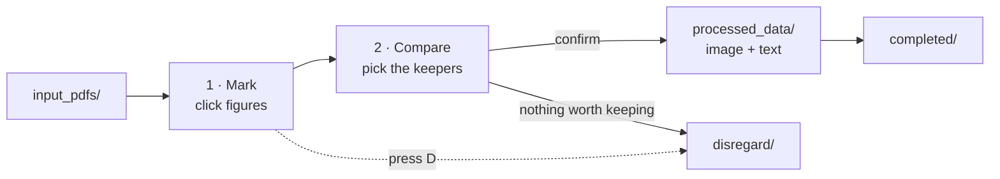
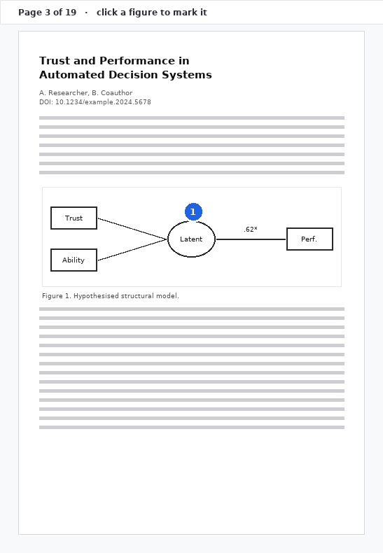
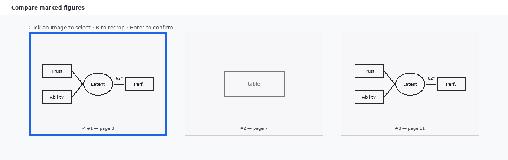
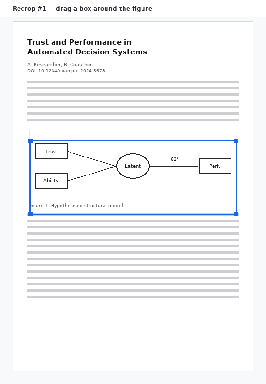

# SEM Diagram Triage

A small Human-In-The-Loop tool for pulling **Structural Equation Model diagrams** out of academic
PDFs. You flip through each paper in the browser, click the figures you care about, pick the ones you
want to keep, and the tool saves each figure as an image plus a text file with the paper's DOI,
authors, journal and the surrounding section text.

The slow part (`docling` layout analysis) only ever runs on the pages you actually click — never on
the whole corpus up front — and it runs in the background so you're never left waiting.

---

## Setup

```bash
python3 -m venv .venv
source .venv/bin/activate
pip install -r requirements.txt
streamlit run sem_triage_app.py
```

Then drop your PDFs into `input_pdfs/` and reload the page.

> **Optional but recommended.** Create a local `.env` file (it's gitignored) to join Crossref's
> "polite pool", which is noticeably faster and far less likely to rate-limit you:
> ```
> CROSSREF_MAILTO=your@email.address
> ```

---

## The workflow in one picture



You handle one PDF at a time. When you finish one, the next loads **immediately** — the saving,
DOI lookup and text extraction finish quietly in the background while you're already working on the
next paper.

---

## Step 1 — Mark the figures

One page at a time, centred. Move with the **←** / **→** arrow keys (or the buttons). Click anywhere
on a figure and a numbered blue circle appears — that's a candidate.



Each click quietly kicks off a `docling` pass on **that one page** to find the figure's exact
boundaries. You don't wait for it: keep flipping pages and clicking. If a marker is still being
worked out it shows as a grey `…` and turns blue when it's ready.

| Key | Action |
| --- | --- |
| **←** / **→** | Previous / next page |
| **Enter** | Done marking → go to compare |
| **D** | Disregard this PDF entirely |

Nothing worth keeping in this paper? Just press **D** and it moves to `disregard/` — no analysis is
run at all.

---

## Step 2 — Compare and choose

All your candidates side by side, each cropped to the figure's real boundaries and captioned with the
figure caption `docling` found. Every thumbnail is the same size, so a wide path diagram doesn't
dwarf a small one.



**Click an image to select it** (blue border + ✓). You can select as many as you like — each one gets
saved separately with its own context. If you only marked one candidate, it's selected automatically,
so you can just hit **Enter**.

| Key | Action |
| --- | --- |
| **Enter** | Confirm the selection and save |
| **R** | Recrop the selected figure (see below) |
| **D** | Disregard this PDF |

---

## Step 3 — Recrop, when the automatic crop misses

Automatic figure detection is good but not perfect — multi-panel figures and unusual layouts can trip
it up. Press **R** (or the ✂ Recrop button under any candidate) and simply **drag a box** around what
you actually want:



The crop is always cut from a fresh high-resolution render, so it looks identical whether you drew
the box at 75% or 200% zoom. A candidate whose automatic crop failed outright is labelled
*extraction failed — press R to redraw*, so nothing is silently lost.

---

## What you get

Confirming writes one image + one text file **per selected figure** into `processed_data/`:

```
processed_data/
├── smith2024_m1.png     ← the cropped figure
├── smith2024_m1.txt     ← its metadata + context
├── smith2024_m3.png     ← a second figure from the same paper
├── smith2024_m3.txt
└── log.jsonl            ← one line per paper handled
```

The `.txt` looks like this:

```text
Title: Trust in Automation: Integrating Empirical Evidence on Factors That Influence Trust
Authors: Kevin Anthony Hoff; Masooda Bashir
Journal: Human Factors: The Journal of the Human Factors and Ergonomics Society
DOI: 10.1177/0018720814547570
DOI source: printed-in-pdf (Crossref-confirmed)

--- First page text ---
(the whole of page 1 — title, authors, abstract …)

--- Section containing the figure (page 7) ---
(the complete section the figure sits in, from its heading to the next one,
 however many pages it spans)
```

The original PDF then moves to `completed/`, or to `disregard/` if you skipped it.

---

## How the DOI is found

Getting this wrong is easy — a title search can confidently return *a different paper*. So the tool
tries the most trustworthy source first and records which one it used in the `DOI source:` line:

1. **The DOI printed in the paper itself**, then confirmed against Crossref. Most reliable: it's the
   paper's own identifier.
2. **The printed DOI, unconfirmed** — used if Crossref is unreachable or doesn't know it.
3. **A Crossref title search** — accepted only if the returned title genuinely matches (≥ 0.75
   similarity), so a near-miss doesn't silently give you the wrong paper.
4. **An OpenAlex title search** — a second opinion for papers Crossref's title index misses, behind
   the same similarity gate.
5. Otherwise `unknown` — some papers genuinely have no DOI, and guessing would be worse.

Lookups are cached per paper, so selecting five figures from one PDF makes **one** request, not five.

---

## Directory layout

| Directory | What's in it |
| --- | --- |
| `input_pdfs/` | Your queue — drop PDFs here |
| `processed_data/` | Output: `<paper>_m<n>.png` + `.txt`, and `log.jsonl` |
| `completed/` | PDFs you kept at least one figure from |
| `disregard/` | PDFs you skipped |

---

## Good to know

- **Your work is per-session.** Markers live in memory, so don't refresh mid-paper — a refresh starts
  that PDF over. Confirmed papers are already safely written to disk.
- **Keyboard shortcuts are ignored while you're typing** in a text field, so they won't fire by
  accident.
- **OCR is off.** It made a single page take ~21s instead of ~2.5s, and published PDFs almost always
  carry a real text layer already. Scanned/image-only PDFs won't yield text — that's the trade-off.
- **`.env` is gitignored** so your email never lands in the repository.
